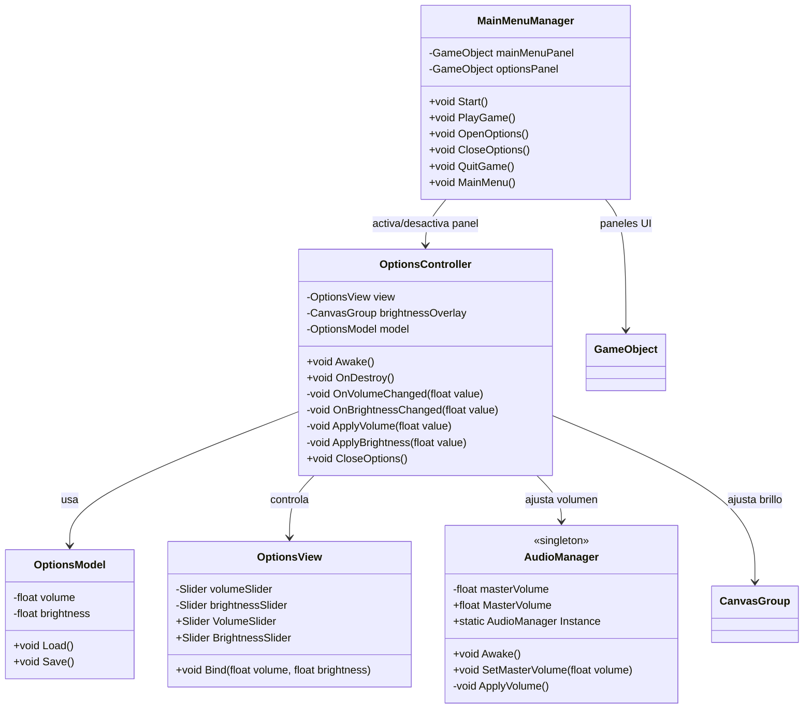
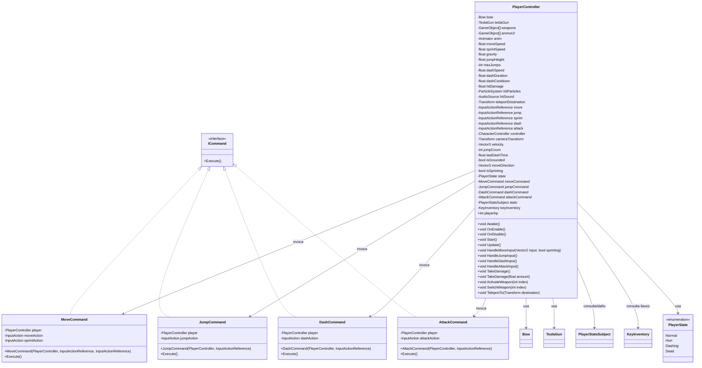
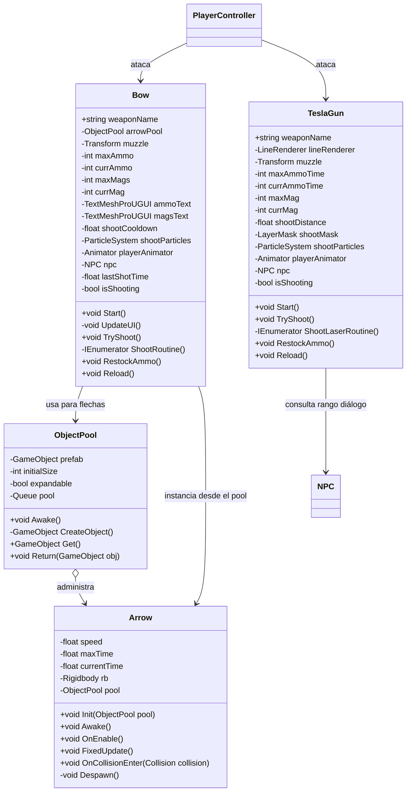
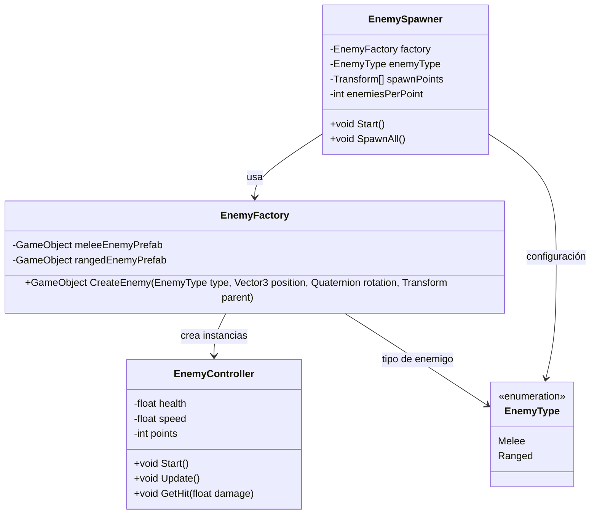
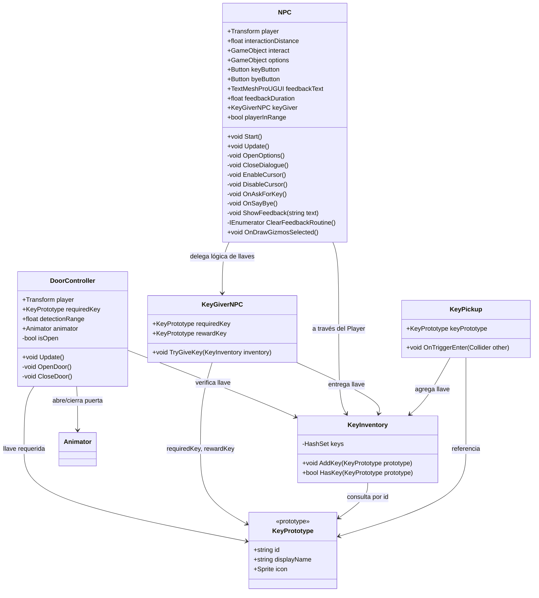
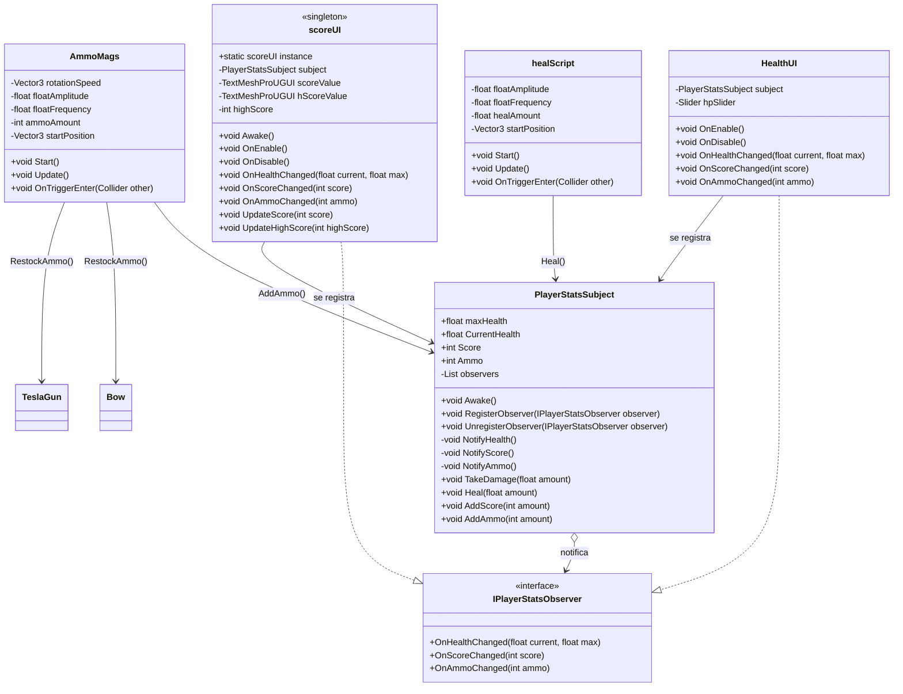
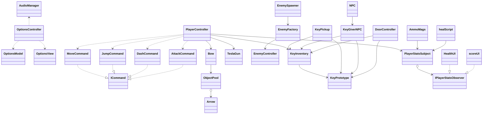

# TheNewFrontier
3D Platformer Refactored Code

Este es un proyecto viejo creado originalmente sin patrones de programación, como se puede ver en el primer commit, en el cual viene el proyecto original. El objetivo de este repositorio es mejorar la estructura de los scripts, usando patrones de programación y principios SOLID para tener un código más limpio, legible y expandible. De la misma manera fue creado usando como referencia otro repositorio de mi propiedad, creado para la materia de Patrones De Diseño de tercer trimestre de la carrera de Programación De Videojuegos en SAE Institute.

Dejo el link a dicho repositorio como referencia: https://github.com/darwok/PatronesDeDise-oCPP.

## Índice
- [Diagrama UML – Singleton & MVC (Audio / Options Menu)](#diagrama-uml--singleton--mvc-audio--options-menu)
- [Diagrama UML – Command + FSM (Player)](#diagrama-uml--command--fsm-player)
- [Diagrama UML – Object Pool & Armas (Bow / Arrow / TeslaGun)](#diagrama-uml--object-pool--armas-bow--arrow--teslagun)
- [Diagrama UML – Factory (EnemySpawner / EnemyFactory)](#diagrama-uml--factory-enemyspawner--enemyfactory)
- [Diagrama UML – Prototype & Keys (Llaves / Puertas / NPC)](#diagrama-uml--prototype--keys-llaves--puertas--npc)
- [Diagrama UML – Observer & Player Stats (Health / Score / Pickups)](#diagrama-uml--observer--player-stats-health--score--pickups)
- [Diagrama general de relaciones entre patrones](#diagrama-general-de-relaciones-entre-patrones)

## Diagrama UML – Singleton & MVC (Audio / Options Menu)

## Diagrama UML – Command + FSM (Player)

## Diagrama UML – Object Pool & Armas (Bow / Arrow / TeslaGun)

## Diagrama UML – Factory (EnemySpawner / EnemyFactory)

## Diagrama UML – Prototype & Keys (Llaves / Puertas / NPC)

## Diagrama UML – Observer & Player Stats (Health / Score / Pickups)

## Diagrama general de relaciones entre patrones

