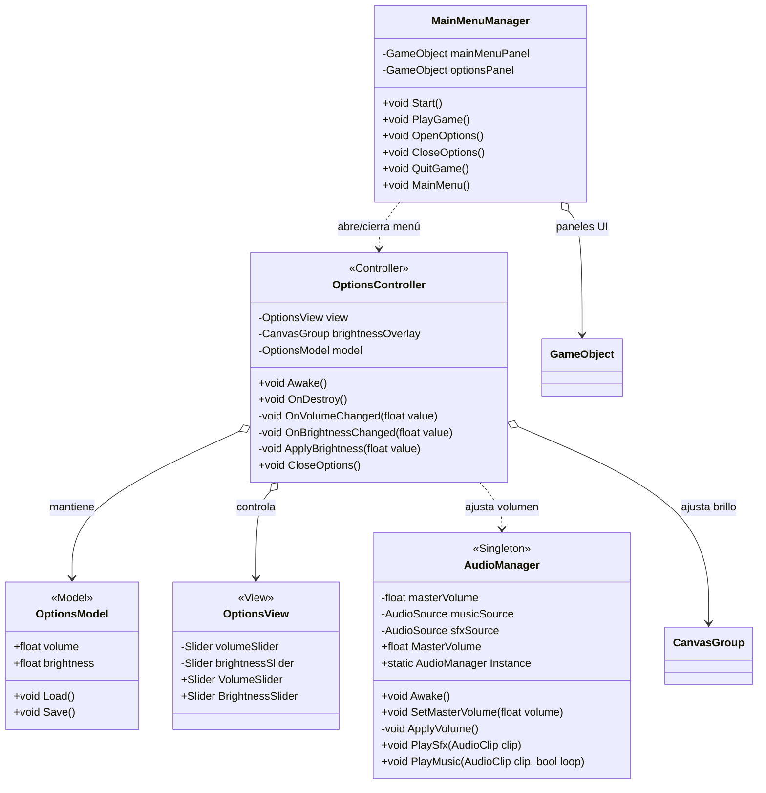
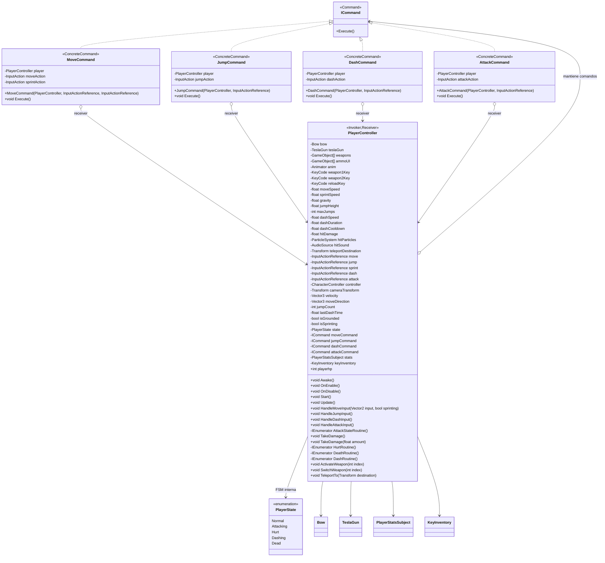
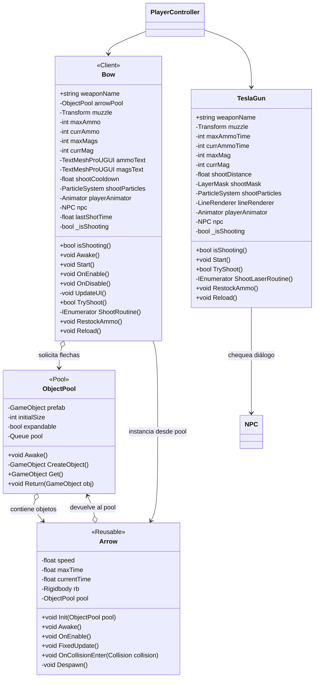
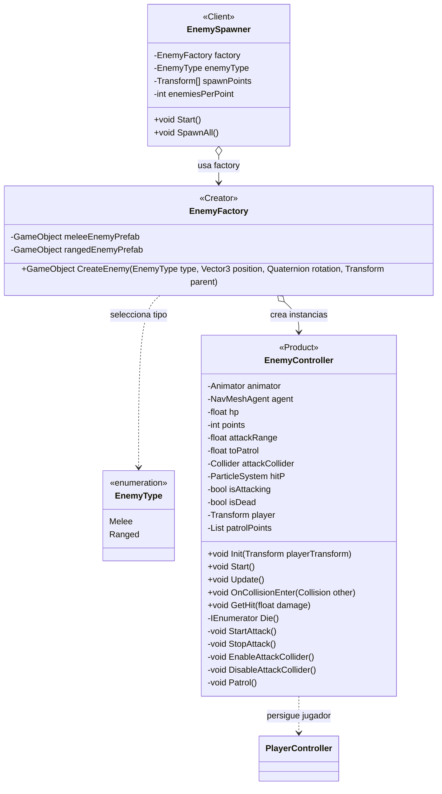

# TheNewFrontier
3D Platformer Refactored Code

Este es un proyecto viejo creado originalmente sin patrones de programación, como se puede ver en el primer commit, en el cual viene el proyecto original. El objetivo de este repositorio es mejorar la estructura de los scripts, usando patrones de programación y principios SOLID para tener un código más limpio, legible y expandible. De la misma manera fue creado usando como referencia otro repositorio de mi propiedad, creado para la materia de Patrones De Diseño de tercer trimestre de la carrera de Programación De Videojuegos en SAE Institute.

Dejo el link a dicho repositorio como referencia: https://github.com/darwok/PatronesDeDise-oCPP.

## Índice
- [Diagrama UML – Singleton & MVC (Audio / Options Menu)](#diagrama-uml--singleton--mvc-audio--options-menu)
- [Diagrama UML – Command + FSM (Player)](#diagrama-uml--command--fsm-player)
- [Diagrama UML – Object Pool & Armas (Bow / Arrow / TeslaGun)](#diagrama-uml--object-pool--armas-bow--arrow--teslagun)
- [Diagrama UML – Factory (EnemySpawner / EnemyFactory)](#diagrama-uml--factory-enemyspawner--enemyfactory)
- [Diagrama UML – Prototype & Keys (Llaves / Puertas / NPC)](#diagrama-uml--prototype--keys-llaves--puertas--npc)
- [Diagrama UML – Observer & Player Stats (Health / Score / Pickups)](#diagrama-uml--observer--player-stats-health--score--pickups)
- [Diagrama general de relaciones entre patrones](#diagrama-general-de-relaciones-entre-patrones)

## Diagrama UML – Singleton & MVC (Audio / Options Menu)

```mermaid
classDiagram
direction TB

class AudioManager {
  <<Singleton>>
  -float masterVolume
  -AudioSource musicSource
  -AudioSource sfxSource
  +float MasterVolume
  +static AudioManager Instance
  +void Awake()
  +void SetMasterVolume(float volume)
  -void ApplyVolume()
  +void PlaySfx(AudioClip clip)
  +void PlayMusic(AudioClip clip, bool loop)
}

class OptionsModel {
  <<Model>>
  +float volume
  +float brightness
  +void Load()
  +void Save()
}

class OptionsView {
  <<View>>
  -Slider volumeSlider
  -Slider brightnessSlider
  +Slider VolumeSlider
  +Slider BrightnessSlider
}

class OptionsController {
  <<Controller>>
  -OptionsView view
  -CanvasGroup brightnessOverlay
  -OptionsModel model
  +void Awake()
  +void OnDestroy()
  -void OnVolumeChanged(float value)
  -void OnBrightnessChanged(float value)
  -void ApplyBrightness(float value)
  +void CloseOptions()
}

class MainMenuManager {
  -GameObject mainMenuPanel
  -GameObject optionsPanel
  +void Start()
  +void PlayGame()
  +void OpenOptions()
  +void CloseOptions()
  +void QuitGame()
  +void MainMenu()
}

OptionsController o--> OptionsModel : mantiene
OptionsController o--> OptionsView : controla
OptionsController ..> AudioManager : ajusta volumen
OptionsController o--> CanvasGroup : ajusta brillo

MainMenuManager ..> OptionsController : abre/cierra menú
MainMenuManager o--> GameObject : paneles UI
```
## Diagrama UML – Command + FSM (Player)

```mermaid
classDiagram
direction TB

class ICommand {
  <<Command>>
  +Execute()
}

class MoveCommand {
  <<ConcreteCommand>>
  -PlayerController player
  -InputAction moveAction
  -InputAction sprintAction
  +MoveCommand(PlayerController, InputActionReference, InputActionReference)
  +void Execute()
}

class JumpCommand {
  <<ConcreteCommand>>
  -PlayerController player
  -InputAction jumpAction
  +JumpCommand(PlayerController, InputActionReference)
  +void Execute()
}

class DashCommand {
  <<ConcreteCommand>>
  -PlayerController player
  -InputAction dashAction
  +DashCommand(PlayerController, InputActionReference)
  +void Execute()
}

class AttackCommand {
  <<ConcreteCommand>>
  -PlayerController player
  -InputAction attackAction
  +AttackCommand(PlayerController, InputActionReference)
  +void Execute()
}

class PlayerState {
  <<enumeration>>
  Normal
  Attacking
  Hurt
  Dashing
  Dead
}

class PlayerController {
  <<Invoker,Receiver>>
  -Bow bow
  -TeslaGun teslaGun
  -GameObject[] weapons
  -GameObject[] ammoUI
  -Animator anim
  -KeyCode weapon1Key
  -KeyCode weapon2Key
  -KeyCode reloadKey
  -float moveSpeed
  -float sprintSpeed
  -float gravity
  -float jumpHeight
  -int maxJumps
  -float dashSpeed
  -float dashDuration
  -float dashCooldown
  -float hitDamage
  -ParticleSystem hitParticles
  -AudioSource hitSound
  -Transform teleportDestination
  -InputActionReference move
  -InputActionReference jump
  -InputActionReference sprint
  -InputActionReference dash
  -InputActionReference attack
  -CharacterController controller
  -Transform cameraTransform
  -Vector3 velocity
  -Vector3 moveDirection
  -int jumpCount
  -float lastDashTime
  -bool isGrounded
  -bool isSprinting
  -PlayerState state
  -ICommand moveCommand
  -ICommand jumpCommand
  -ICommand dashCommand
  -ICommand attackCommand
  -PlayerStatsSubject stats
  -KeyInventory keyInventory
  +int playerhp
  +void Awake()
  +void OnEnable()
  +void OnDisable()
  +void Start()
  +void Update()
  +void HandleMoveInput(Vector2 input, bool sprinting)
  +void HandleJumpInput()
  +void HandleDashInput()
  +void HandleAttackInput()
  -IEnumerator AttackStateRoutine()
  +void TakeDamage()
  +void TakeDamage(float amount)
  -IEnumerator HurtRoutine()
  -IEnumerator DeathRoutine()
  -IEnumerator DashRoutine()
  +void ActivateWeapon(int index)
  +void SwitchWeapon(int index)
  +void TeleportTo(Transform destination)
}

ICommand <|.. MoveCommand
ICommand <|.. JumpCommand
ICommand <|.. DashCommand
ICommand <|.. AttackCommand

PlayerController o--> ICommand : mantiene comandos
MoveCommand o--> PlayerController : receiver
JumpCommand o--> PlayerController : receiver
DashCommand o--> PlayerController : receiver
AttackCommand o--> PlayerController : receiver

PlayerController --> PlayerState : FSM interna
PlayerController --> Bow
PlayerController --> TeslaGun
PlayerController --> PlayerStatsSubject
PlayerController --> KeyInventory
```
## Diagrama UML – Object Pool & Armas (Bow / Arrow / TeslaGun)

```mermaid
classDiagram
direction TB

class ObjectPool {
  <<Pool>>
  -GameObject prefab
  -int initialSize
  -bool expandable
  -Queue<GameObject> pool
  +void Awake()
  -GameObject CreateObject()
  +GameObject Get()
  +void Return(GameObject obj)
}

class Arrow {
  <<Reusable>>
  -float speed
  -float maxTime
  -float currentTime
  -Rigidbody rb
  -ObjectPool pool
  +void Init(ObjectPool pool)
  +void Awake()
  +void OnEnable()
  +void FixedUpdate()
  +void OnCollisionEnter(Collision collision)
  -void Despawn()
}

class Bow {
  <<Client>>
  +string weaponName
  -ObjectPool arrowPool
  -Transform muzzle
  -int maxAmmo
  -int currAmmo
  -int maxMags
  -int currMag
  -TextMeshProUGUI ammoText
  -TextMeshProUGUI magsText
  -float shootCooldown
  -ParticleSystem shootParticles
  -Animator playerAnimator
  -NPC npc
  -float lastShotTime
  -bool _isShooting
  +bool isShooting()
  +void Awake()
  +void Start()
  +void OnEnable()
  +void OnDisable()
  -void UpdateUI()
  +bool TryShoot()
  -IEnumerator ShootRoutine()
  +void RestockAmmo()
  +void Reload()
}

class TeslaGun {
  +string weaponName
  -Transform muzzle
  -int maxAmmoTime
  -int currAmmoTime
  -int maxMag
  -int currMag
  -float shootDistance
  -LayerMask shootMask
  -ParticleSystem shootParticles
  -LineRenderer lineRenderer
  -Animator playerAnimator
  -NPC npc
  -bool _isShooting
  +bool isShooting()
  +void Start()
  +bool TryShoot()
  -IEnumerator ShootLaserRoutine()
  +void RestockAmmo()
  +void Reload()
}

ObjectPool o--> Arrow : contiene objetos
Arrow o--> ObjectPool : devuelve al pool
Bow o--> ObjectPool : solicita flechas
Bow --> Arrow : instancia desde pool
PlayerController --> Bow
PlayerController --> TeslaGun
TeslaGun --> NPC : chequea diálogo
```
## Diagrama UML – Factory (EnemySpawner / EnemyFactory)

```mermaid
classDiagram
direction TB

class EnemyType {
  <<enumeration>>
  Melee
  Ranged
}

class EnemyController {
  <<Product>>
  -Animator animator
  -NavMeshAgent agent
  -float hp
  -int points
  -float attackRange
  -float toPatrol
  -Collider attackCollider
  -ParticleSystem hitP
  -bool isAttacking
  -bool isDead
  -Transform player
  -List<Transform> patrolPoints
  +void Init(Transform playerTransform)
  +void Start()
  +void Update()
  +void OnCollisionEnter(Collision other)
  +void GetHit(float damage)
  -IEnumerator Die()
  -void StartAttack()
  -void StopAttack()
  -void EnableAttackCollider()
  -void DisableAttackCollider()
  -void Patrol()
}

class EnemyFactory {
  <<Creator>>
  -GameObject meleeEnemyPrefab
  -GameObject rangedEnemyPrefab
  +GameObject CreateEnemy(EnemyType type, Vector3 position, Quaternion rotation, Transform parent)
}

class EnemySpawner {
  <<Client>>
  -EnemyFactory factory
  -EnemyType enemyType
  -Transform[] spawnPoints
  -int enemiesPerPoint
  +void Start()
  +void SpawnAll()
}

EnemySpawner o--> EnemyFactory : usa factory
EnemyFactory o--> EnemyController : crea instancias
EnemyFactory ..> EnemyType : selecciona tipo
EnemyController ..> PlayerController : persigue jugador
```
## Diagrama UML – Prototype & Keys (Llaves / Puertas / NPC)
```mermaid
classDiagram
direction TB

class KeyPrototype {
  <<Prototype>>
  +string id
  +string displayName
  +Sprite icon
}

class KeyInventory {
  <<Client>>
  -HashSet<string> keys
  +void AddKey(KeyPrototype prototype)
  +bool HasKey(KeyPrototype prototype)
}

class KeyPickup {
  <<Client>>
  +KeyPrototype keyPrototype
  +void OnTriggerEnter(Collider other)
}

class KeyGiverNPC {
  <<Client>>
  +KeyPrototype requiredKey
  +KeyPrototype rewardKey
  +void TryGiveKey(KeyInventory inventory)
}

class DoorController {
  <<Client>>
  +Transform player
  +KeyPrototype requiredKey
  +float detectionRange
  +Animator animator
  -bool isOpen
  +void Start()
  +void Update()
  -void UpdateDoorState(bool inRange, bool hasKey)
  -void OpenDoor()
  -void CloseDoor()
}

class NPC {
  <<Client>>
  +Transform player
  +float interactionDistance
  +GameObject interact
  +GameObject options
  +Button keyButton
  +Button byeButton
  +TextMeshProUGUI feedbackText
  +float feedbackDuration
  +KeyGiverNPC keyGiver
  +bool playerInRange
  +void Start()
  +void Update()
  -void OpenOptions()
  -void CloseDialogue()
  -void EnableCursor()
  -void DisableCursor()
  -void OnAskForKey()
  -void OnSayBye()
  -void ShowFeedback(string text)
  -IEnumerator ClearFeedbackRoutine()
  +void OnDrawGizmosSelected()
}

KeyInventory ..> KeyPrototype : usa id

KeyPickup --> KeyPrototype : referencia
KeyPickup ..> KeyInventory : agrega al inventario del jugador

KeyGiverNPC --> KeyPrototype : required/reward
KeyGiverNPC ..> KeyInventory : da llaves

NPC o--> KeyGiverNPC : delega llaves
DoorController --> KeyPrototype : llave requerida
DoorController ..> KeyInventory : consulta llaves
DoorController --> Animator : estados hasKey/isOpen
PlayerController o--> KeyInventory : guarda llaves
```
## Diagrama UML – Observer & Player Stats (Health / Score / Pickups)
```mermaid
classDiagram
direction TB

class IPlayerStatsObserver {
  <<Observer>>
  +OnHealthChanged(float current, float max)
  +OnScoreChanged(int score)
  +OnAmmoChanged(int ammo)
}

class PlayerStatsSubject {
  <<Subject>>
  +float maxHealth
  +float CurrentHealth
  +int Score
  +int Ammo
  -List<IPlayerStatsObserver> observers
  +void Awake()
  +void RegisterObserver(IPlayerStatsObserver observer)
  +void UnregisterObserver(IPlayerStatsObserver observer)
  -void NotifyHealth()
  -void NotifyScore()
  -void NotifyAmmo()
  +void TakeDamage(float amount)
  +void Heal(float amount)
  +void AddScore(int amount)
  +void AddAmmo(int amount)
}

class HealthUI {
  <<ConcreteObserver>>
  -PlayerStatsSubject subject
  -Slider hpSlider
  +void OnEnable()
  +void OnDisable()
  +void OnHealthChanged(float current, float max)
  +void OnScoreChanged(int score)
  +void OnAmmoChanged(int ammo)
}

class scoreUI {
  <<ConcreteObserver,Singleton>>
  +static scoreUI instance
  -PlayerStatsSubject subject
  -TextMeshProUGUI scoreValue
  -TextMeshProUGUI hScoreValue
  -int highScore
  +void Awake()
  +void OnEnable()
  +void OnDisable()
  +void OnHealthChanged(float current, float max)
  +void OnScoreChanged(int score)
  +void OnAmmoChanged(int ammo)
  +void UpdateScore(int score)
  +void UpdateHighScore(int highScore)
}

class AmmoMags {
  -Vector3 rotationSpeed
  -float floatAmplitude
  -float floatFrequency
  -int ammoAmount
  -Vector3 startPosition
  +void Start()
  +void Update()
  +void OnTriggerEnter(Collider other)
}

class healScript {
  -float floatAmplitude
  -float floatFrequency
  -float healAmount
  -Vector3 startPosition
  +void Start()
  +void Update()
  +void OnTriggerEnter(Collider other)
}

PlayerStatsSubject o--> IPlayerStatsObserver : notifica cambios

HealthUI ..|> IPlayerStatsObserver
scoreUI ..|> IPlayerStatsObserver

HealthUI o--> PlayerStatsSubject : se registra
scoreUI o--> PlayerStatsSubject : se registra

AmmoMags ..> PlayerStatsSubject : AddAmmo()
AmmoMags ..> Bow : RestockAmmo()
AmmoMags ..> TeslaGun : RestockAmmo()

healScript ..> PlayerStatsSubject : Heal()

PlayerController o--> PlayerStatsSubject : daño/score
```
